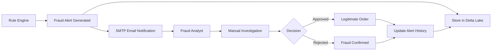

```mermaid
flowchart LR

    A["Rule Engine"]

    A --> B["Fraud Alert Generated"]

    B --> C["Store in Delta Lake"]

    B --> D["SMTP Email Notification"]

    D --> E["Fraud Analyst"]

    E --> F["Manual Investigation"]

    F --> G{"Decision"}

    G -->|Approved| H["Legitimate Order"]

    G -->|Rejected| I["Fraud Confirmed"]

    H --> J["Update Alert History"]

    I --> J

    J --> C

```

```
```
