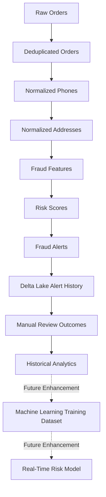

```mermaid
flowchart TB

    A["Raw Orders"]

    A --> B["Deduplicated Orders"]

    B --> C["Normalized Phones"]

    C --> D["Normalized Addresses"]

    D --> E["Fraud Features"]

    E --> F["Risk Scores"]

    F --> G["Fraud Alerts"]

    G --> H["Delta Lake Alert History"]

    H --> I["Manual Review Outcomes"]

    I --> J["Historical Analytics"]

    J -. Future Enhancement .-> K["Machine Learning Training Dataset"]

    K -. Future Enhancement .-> L["Real-Time Risk Model"]

```

```
```
