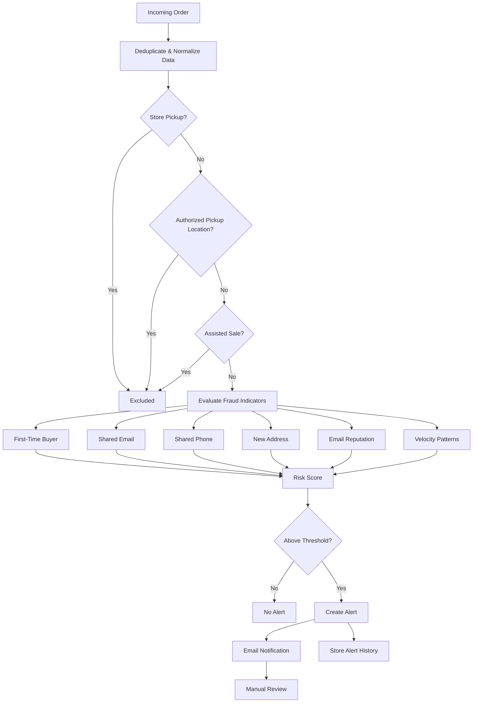

```mermaid
flowchart TD

    A["Incoming Order"]

    A --> B["Deduplicate & Normalize Data"]

    B --> C{"Store Pickup?"}

    C -->|Yes| Z["Excluded"]

    C -->|No| D{"Authorized Pickup Location?"}

    D -->|Yes| Z

    D -->|No| E{"Assisted Sale?"}

    E -->|Yes| Z

    E -->|No| F["Evaluate Fraud Indicators"]

    F --> G["First-Time Buyer"]

    F --> H["Shared Email"]

    F --> I["Shared Phone"]

    F --> J["New Address"]

    F --> K["Email Reputation"]

    F --> L["Velocity Patterns"]

    G --> M["Risk Score"]

    H --> M

    I --> M

    J --> M

    K --> M

    L --> M

    M --> N{"Above Threshold?"}

    N -->|No| O["No Alert"]

    N -->|Yes| P["Create Alert"]

    P --> Q["Email Notification"]

    P --> R["Store Alert History"]

    Q --> S["Manual Review"]

```

```
```
