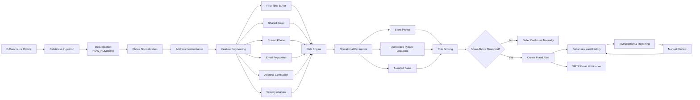

```mermaid
flowchart LR

    A["E-Commerce Orders"] --> B["Databricks Ingestion"]

    B --> C["Deduplication<br/>ROW_NUMBER()"]

    C --> D["Phone Normalization"]

    D --> E["Address Normalization"]

    E --> F["Feature Engineering"]

    F --> F1["First-Time Buyer"]
    F --> F2["Shared Email"]
    F --> F3["Shared Phone"]
    F --> F4["Email Reputation"]
    F --> F5["Address Correlation"]
    F --> F6["Velocity Analysis"]

    F1 --> G["Rule Engine"]
    F2 --> G
    F3 --> G
    F4 --> G
    F5 --> G
    F6 --> G

    G --> H["Operational Exclusions"]

    H --> H1["Store Pickup"]
    H --> H2["Authorized Pickup Locations"]
    H --> H3["Assisted Sales"]

    H1 --> I["Risk Scoring"]
    H2 --> I
    H3 --> I

    I --> J{"Score Above Threshold?"}

    J -->|No| K["Order Continues Normally"]

    J -->|Yes| L["Create Fraud Alert"]

    L --> M["Delta Lake Alert History"]

    L --> N["SMTP Email Notification"]

    M --> O["Investigation & Reporting"]

    O --> P["Manual Review"]

    P --> M
```
